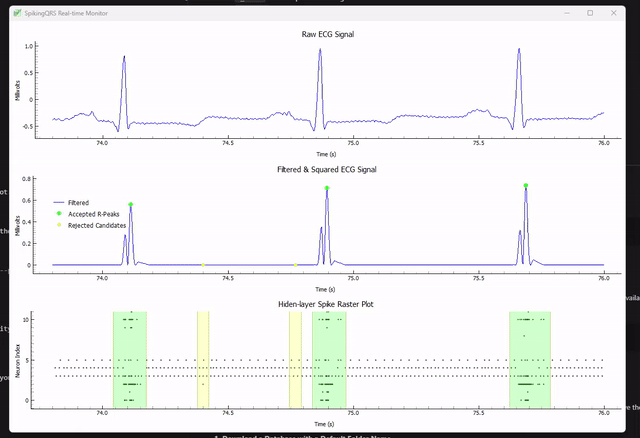
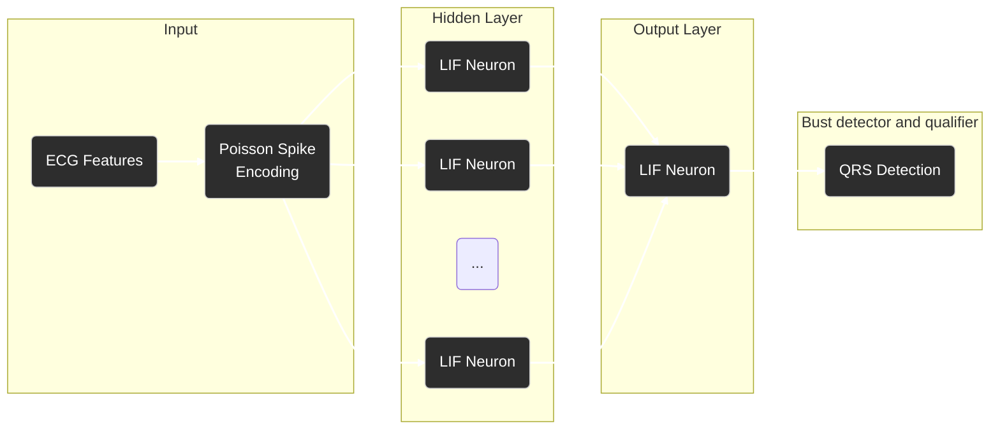

[Paper]

# SpikingQrs
A shallow and biologically plausible spiking neural network-based QRS detection system for ECG signal processing using adaptive homeostatic modulation for continual unsupervised learning. 

This work will be presented at Computing in Cardiology 2025.



Under Construction 🚧

---


## Benchmark Results

The following table shows the beat detection performance across different datasets compared to state-of-the-art methods:

| Dataset | # of Beats | Method | TPR% | PPV% | DER% |
|---------|------------|--------|------|------|------|
| **MITBIH** | 109,966 | **Spiking QRS** | **99.53** | **99.72** | **0.77** |
| | | Pan & Tompkins | 99.24 | 99.11 | 1.48 |
| | | Hamilton et al. | 97.98 | 98.68 | 3.18 |
| | | Elgendi et al. | 98.36 | 97.18 | 4.35 |
| | | Kalidas et al. | 97.25 | 99.15 | 3.71 |
| **QTDB** | 87,110 | **Spiking QRS** | **99.76** | 99.92 | **0.29** |
| | | Pan & Tompkins | 99.44 | 99.24 | 1.09 |
| | | Hamilton et al. | 99.61 | 99.46 | 0.81 |
| | | Elgendi et al. | 99.53 | 97.35 | 2.92 |
| | | Kalidas et al. | 99.32 | **99.94** | 0.78 |
| **SVDB** | 184,582 | **Spiking QRS** | 99.72 | 99.74 | 0.66 |
| | | Pan & Tompkins | **99.84** | 99.61 | **0.65** |
| | | Hamilton et al. | 99.39 | **99.84** | 0.85 |
| | | Elgendi et al. | 98.99 | 98.20 | 2.82 |
| | | Kalidas et al. | 99.15 | 99.74 | 1.08 |
| **TWADB** | 18,993 | **Spiking QRS** | 97.43 | **98.03** | **4.66** |
| | | Pan & Tompkins | **98.09** | 97.42 | 4.74 |
| | | Hamilton et al. | 97.58 | 94.69 | 7.88 |
| | | Elgendi et al. | 95.03 | 95.33 | 11.34 |
| | | Kalidas et al. | 95.85 | 96.44 | 7.79 |
| **NSRDB** | 1,799,697 | **Spiking QRS** | **96.74** | **99.92** | **3.57** |
| | | Pan & Tompkins | 92.69 | 99.71 | 7.42 |
| | | Hamilton et al. | 96.61 | 99.91 | 3.70 |
| | | Elgendi et al. | 96.76 | 84.82 | 20.84 |
| | | Kalidas et al. | 92.67 | 99.74 | 7.43 |
| **NSTDB** | 25,590 | **Spiking QRS** | **96.13** | 86.95 | 19.42 |
| | | Pan & Tompkins | 93.11 | 86.20 | 22.54 |
| | | Hamilton et al. | 94.63 | 87.11 | 20.28 |
| | | Elgendi et al. | 93.79 | 86.12 | 21.95 |
| | | Kalidas et al. | 93.59 | **91.37** | **15.46** |

*TPR: True Positive Rate, PPV: Positive Predictive Value, DER: Detection Error Rate*

**Bold values indicate the best performance for each metric within each dataset.**

## Network Topology

The SpikingQRS system uses a two-layer spiking neural network. The architecture is visualized below:



## Learning Algorithm Details

The network learns through a combination of Spike-Timing-Dependent Plasticity (STDP) for synaptic weight updates and novel adaptive homeostasis modulation to regulate firing rates and synaptic weights. The introduced adaptive homeostatic modulation ensures that the network adapts its firing activity according to the ECG signal QRS spatiotemporal dynamics.  

### 1. Leaky Integrate-and-Fire (LIF) Neuron Model

Each neuron's membrane potential $U_i$ is updated at each discrete time step $t$ based on the input current, which is a weighted sum of spikes from pre-synaptic neurons:

$$ U_i(t+1) = \beta U_i(t) + \sum_j W_{ij} S_j(t) $$

When the membrane potential exceeds the neuron's adaptive threshold $ \Theta_i $, it fires a spike $ S_i(t+1) = 1 $ and its potential is reset to zero.

### 2. STDP Synaptic Modification

Synaptic weights $ W_{ij} $ are updated based on the temporal correlation of pre- and post-synaptic spikes, captured by synaptic traces.

**Synaptic Traces:**
The pre-synaptic trace $T_{pre}$ and post-synaptic trace $T_{post}$ are updated as follows:
$$ T_{pre,j}(t+1) = T_{pre,j}(t) \cdot e^{-1/\tau_+} + A_+ \cdot S_{pre,j}(t+1) $$
$$ T_{post,i}(t+1) = T_{post,i}(t) \cdot e^{-1/\tau_-} + A_- \cdot S_{post,i}(t+1) $$
where $ \tau_+ $ and $ \tau_- $ are the trace time constants, and $ A_+ $ and $ A_- $ are the learning amplitudes.

**Weight Update:**
The change in synaptic weight $ \Delta W_{ij} $ is calculated based on the outer product of these traces, modulated by a learning rate $ \eta $:
$$ \Delta W_{ij} = \eta \cdot T_{post,i} \cdot T_{pre,j} $$

### 3. Adaptive Homeostasis

To maintain a stable firing rate $ R_i $ within a target range $[R_{min}, R_{max}]$, each neuron's firing threshold $ \Theta_i $ is adjusted dynamically.

**Threshold Adjustment:**
If the neuron's firing rate deviates from the target range, the threshold is adjusted:
$$ \Delta \Theta_i = \begin{cases} -\alpha(R_{min} - R_i) & \text{if } R_i < R_{min} \\ 2\alpha(R_i - R_{max}) & \text{if } R_i > R_{max} \end{cases} $$
where $ \alpha $ is the homeostasis scaling factor.

**Threshold Decay:**
The threshold then decays back towards a base value $ \Theta_{base} $, ensuring stability:
$$ \Theta_i(t+1) = (\Theta_i(t) + \Delta \Theta_i) \cdot \delta_{decay} + (1 - \delta_{decay}) \Theta_{base} $$

### 4. Activity-Dependent Weight Scaling

For the output layer, the final synaptic weights are scaled by a factor $ \gamma $ that is dependent on the output neuron's firing rate $ R_{out} $:
$$ \gamma = \sigma(10 \cdot (R_{max} - R_{out})) $$
$$ W_{out} \leftarrow \gamma \cdot W_{out} $$
where $ \sigma(x) $ is the sigmoid function. This mechanism reduces learning when the neuron is firing too frequently.

# SpikingQRS Configuration System

This document describes how to use the YAML-based configuration system for the SpikingQRS project.

## Configuration File Structure

The main configuration file is `config.yaml` which contains all hyperparameters organized into logical sections:

### Data Processing Parameters
- `chunk_size`: Size of ECG segments for processing
- `overlap`: Overlap between consecutive chunks
- `detection_delay`: Delay caused by in beat detection system components, e.g. filters
- `exclude_artifacts`: Whether to exclude non-QRS annotations
- `sampling_rate`: Default sampling rate for ECG signals

### Neural Network Architecture
- `input_size`: Number of input neurons (Poison time steps)
- `hidden_size`: Number of hidden layer neurons
- `output_size`: Number of output neurons
- `num_time_steps`: Number of time steps for simulation
- `batch_size`: Batch size for processing
- `seed`: Random seed for reproducibility

### Learning Parameters
- `learning_rate`: Learning rate for weight updates
- `target_rate`: Target firing rate for neurons
- `target_rate_min`: Minimum acceptable firing rate
- `target_rate_max`: Maximum acceptable firing rate

### STDP Parameters
- `A_plus`: STDP potentiation strength
- `A_minus`: STDP depression strength
- `tau_plus`: STDP potentiation time constant
- `tau_minus`: STDP depression time constant

### Homeostasis Parameters
- `alpha`: Homeostasis scaling factor for hidden layer
- `beta`: Homeostasis scaling factor for output layer

### Detection Parameters
- `threshold`: Detection threshold
- `min_interval`: Minimum interval between detections

## Usage

### Basic Usage

To set up the required environment for this project, you need to have Conda installed. Then, you can create the environment from the `environment.yml` file:

```bash
conda env create -f environment.yml
```

This will create a new Conda environment named `beatdetectionenv` with all the necessary dependencies. To activate it, run:

```bash
conda activate beatdetectionenv
```

**1. Run on a single ECG record with streaming visualization**


```bash
python main.py --dataset toy_dataset --record 100 --enable-plotting
```
This will display the ECG signal, spike trains, and detected R-peaks in a live plot.

**2. Run a Full Dataset Benchmark**

To run a benchmark on an entire dataset (e.g., MIT-BIH Arrhythmia Database), use the following command. This example uses all available CPU cores for parallel processing.

```bash
python main.py --dataset mit-bih-arrhythmia-database-1.0.0 --dataset-name MITBIH --parallel-jobs -1
```
Results will be saved in the `results/` directory.

### Downloading New Datasets

You can easily download other ECG datasets from PhysioNet using the provided utility function. The function will automatically save the data into a new folder under the `data/` directory.

**1. Download a Database with a Default Folder Name**

To download a new database, such as the European ST-T Database (db code: `edb`), you can call the `download_mitbih` function with the appropriate database code.

```python
from utils.mit_data_handler import download_mitbih

# This will download the 'edb' database to 'data/edb_database'
download_mitbih(db_code="edb")
```

**2. Download a Database with a Custom Folder Name**

You can also specify a custom folder name for the download.

```python
from utils.mit_data_handler import download_mitbih

# This will download the 'nstdb' database to 'data/my_noise_db'
download_mitbih(db_code="nstdb", folder_name="my_noise_db")
```

## License

This project is licensed under the MIT License. See the [LICENSE](LICENSE) file for details.